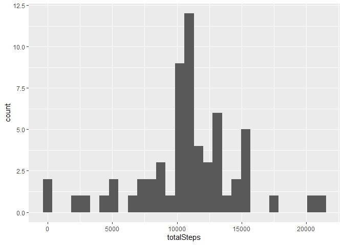
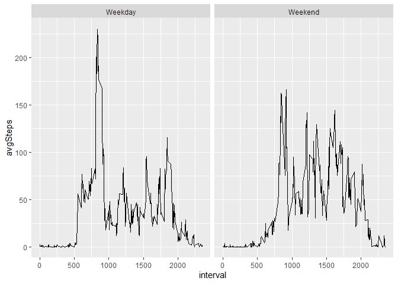

## Introduction

This project makes use of data from a personal activity monitoring device. This device collects data at 5 minute intervals through out the day. The data consists of two months of data from an anonymous individual collected during the months of October and November, 2012 and include the number of steps taken in 5 minute intervals each day.

### Loading Required Packages

```r
library(dplyr)
library(ggplot2)
```

### Loading Data

```r
activityData <- read.csv("repdata_data_activity/activity.csv")
```


### Basic EDA of the data

```r
head(activityData)
```

```
##   steps       date interval
## 1    NA 2012-10-01        0
## 2    NA 2012-10-01        5
## 3    NA 2012-10-01       10
## 4    NA 2012-10-01       15
## 5    NA 2012-10-01       20
## 6    NA 2012-10-01       25
```


```r
str(activityData)
```

```
## 'data.frame':	17568 obs. of  3 variables:
##  $ steps   : int  NA NA NA NA NA NA NA NA NA NA ...
##  $ date    : Factor w/ 61 levels "2012-10-01","2012-10-02",..: 1 1 1 1 1 1 1 1 1 1 ...
##  $ interval: int  0 5 10 15 20 25 30 35 40 45 ...
```

```r
summary(activityData)
```

```
##      steps                date          interval     
##  Min.   :  0.00   2012-10-01:  288   Min.   :   0.0  
##  1st Qu.:  0.00   2012-10-02:  288   1st Qu.: 588.8  
##  Median :  0.00   2012-10-03:  288   Median :1177.5  
##  Mean   : 37.38   2012-10-04:  288   Mean   :1177.5  
##  3rd Qu.: 12.00   2012-10-05:  288   3rd Qu.:1766.2  
##  Max.   :806.00   2012-10-06:  288   Max.   :2355.0  
##  NA's   :2304     (Other)   :15840
```

There are **2304** missing values in the dataset.

### Number of Steps taken per day


```r
stepsPerDay <- activityData %>%
                group_by(date) %>%
                summarise(totalSteps = sum(steps,na.rm = TRUE))

ggplot(stepsPerDay,aes(x = totalSteps)) +
  geom_histogram()
```

```
## `stat_bin()` using `bins = 30`. Pick better value with `binwidth`.
```

<!-- -->


```r
mean(stepsPerDay$totalSteps)
```

```
## [1] 9354.23
```

```r
median(stepsPerDay$totalSteps)
```

```
## [1] 10395
```

Mean of Steps taken per Day : **9354.2295082**
Median of Steps taken per Day : **10395**

### Average Daily activity pattern

```r
stepsPerInterval <- activityData %>%
                      group_by(interval) %>%
                      summarise(avgSteps = mean(steps,na.rm = TRUE))

ggplot(stepsPerInterval,aes(x = interval,y=avgSteps)) +
  geom_line()
```

<!-- -->


```r
stepsPerInterval[which.max(stepsPerInterval$avgSteps),1]
```

```
## # A tibble: 1 x 1
##   interval
##      <int>
## 1      835
```

835 is the 5-minute interval where we see the highest average number of steps taken each day.


### Number of Missing Values

```r
sum(is.na.data.frame(activityData))
```

```
## [1] 2304
```

There are total of **2304** missing values in the data.


Before imputing the missing values let us check the pattern of missing values for each day:

```r
activityData %>%
  group_by(date) %>%
  summarise(missingValues = sum(is.na(steps))) %>%
  filter(missingValues > 0)
```

```
## # A tibble: 8 x 2
##   date       missingValues
##   <fct>              <int>
## 1 2012-10-01           288
## 2 2012-10-08           288
## 3 2012-11-01           288
## 4 2012-11-04           288
## 5 2012-11-09           288
## 6 2012-11-10           288
## 7 2012-11-14           288
## 8 2012-11-30           288
```

We can clearly see that data is missing for some days entirely rather than for some intervals. So, one way we can impute the data is by replacing the missing values with mean for the same interval.

### Imputing Missing values


```r
replaceMissing <- function(df){
for(i in 1:nrow(df)){
  if(is.na(df[i,'steps'])){
    df[i,'steps'] = floor(stepsPerInterval[which(stepsPerInterval$interval %in% df[i,3]),'avgSteps'])
  }
}
  return(df)
}
```


```r
newData <- replaceMissing(activityData)
sum(is.na.data.frame(newData)) ## Checking Missing Values
```

```
## [1] 0
```


### Reporting New values and plots


```r
stepsPerDayNew <- newData %>%
                group_by(date) %>%
                summarise(totalSteps = sum(steps))

ggplot(stepsPerDayNew,aes(x = totalSteps)) +
  geom_histogram()
```

```
## `stat_bin()` using `bins = 30`. Pick better value with `binwidth`.
```

<!-- -->


```r
mean(stepsPerDayNew$totalSteps)
```

```
## [1] 10749.77
```

```r
median(stepsPerDayNew$totalSteps)
```

```
## [1] 10641
```


- The distribution of steps has now become unimodal after imputing the missing values. As expected, the earlier peak at 0 has disappeared.
- The mean and median have also gone up.

### Difference between activity pattern in Weekdays and Weekends

```r
newData$date = as.Date(newData$date)
newData$dayType = ifelse(weekdays(newData$date) %in% c("Saturday","Sunday"),"Weekend","Weekday")
newData$dayType = as.factor(newData$dayType)
```


```r
stepsPerIntervalNew <- newData %>%
                      group_by(interval,dayType) %>%
                      summarise(avgSteps = mean(steps))

ggplot(stepsPerIntervalNew,aes(x = interval,y=avgSteps)) +
  geom_line() +
  facet_wrap(~dayType)
```

<!-- -->


